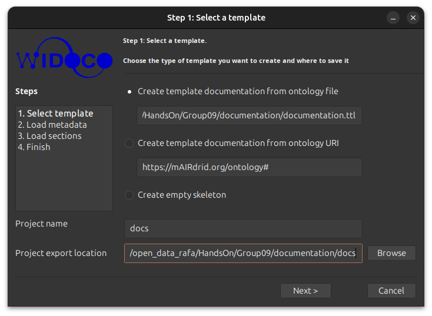
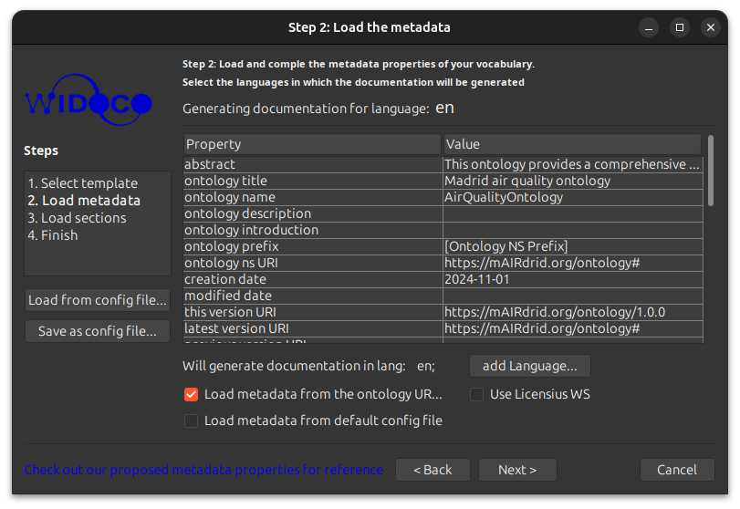
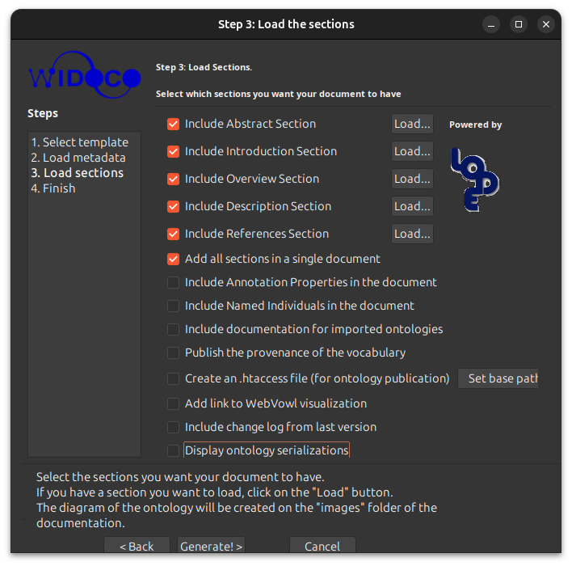

# Documentation process
This document describes the process to generate the documentation of the project.

## Pre-requisites
To run the documentation process, it is necessary to have installed:
- Java 11/14/17
  - In Ubuntu 24.04: `sudo apt install openjdk-11-jdk`

> Java requeriments are for Widoco: [Widoco releases](https://github.com/dgarijo/WIDOCO/releases/tag/v1.4.25)

## Generation
To generate the documentation folder `docs`, the following command has been used (java 17):

1. Get [Widoco](https://github.com/dgarijo/Widoco) tool:
```bash
wget https://github.com/dgarijo/Widoco/releases/download/v1.4.25/widoco-1.4.25-jar-with-dependencies_JDK-17.jar
```

2. To iniciate the tool:
```bash
java -jar widoco-1.4.25-jar-with-dependencies_JDK-17.jar
```

3. Then, `documentation.ttl` file should be selected and the output folder `docs` should be specified.



4. After that, a metadata config window appear. Don't change anything and click on `Next`.


5. As last step, section loading should be configured. .htmls files should be loaded (keep activated the options),
activate "Add all sections in a single document" and deactivate each other option. Then, click on `Generate!`.
> Abstract is already included in `documentation.ttl`, so there is no .html for it.


6. Finally, the documentation is generated in the `docs` folder: `index-en.html`.
