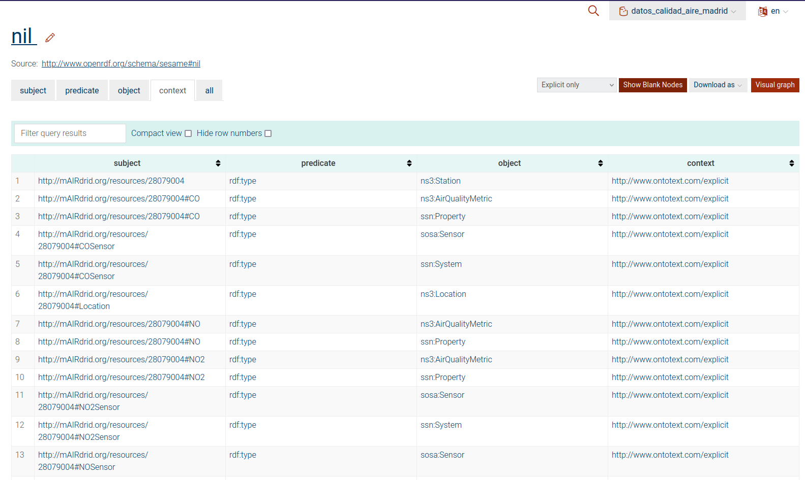

# Hands-on Publishing – Self assessment
## Linked data publishing
For the linked data publishing we tried to use Helio but our ontology weights ~40MB and the application couldn't manage it.
Then, we opted to publish it in GraphDB, because it allows to publish a local ontology.

## Ontology publication
We tried to use Ontoology publish the ontology but we couldn't make it work.
We opted to generate the [documentation](documentation/) with Widoco.

> Documentation available in `documentation/docs/index_en.html`
